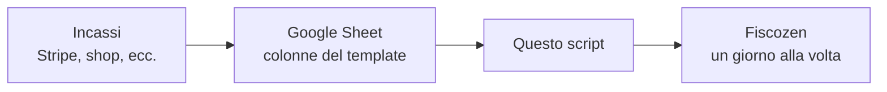

<div align="center">

# fiscozen-corrispettivi

**Corrispettivi su Fiscozen, compilati da un Google Sheet**

[](https://nodejs.org/)
[](https://playwright.dev/)
[](https://developers.google.com/sheets)
[](LICENSE)

[Uso](#uso-mensile) · [Prima volta](#prima-volta) · [Template foglio](examples/sheet-template.csv) · [Licenza](LICENSE)

</div>

Ditta individuale, vendite online, pagamenti tipo Stripe. Quasi mai ha senso una fattura elettronica per ogni transazione. Quegli importi finiscono nei **corrispettivi** di Fiscozen: un giorno, un totale, a mano.

Fiscozen non ha un’API. A fine mese ti ritrovi con un export (o un foglio) e la pagina `/app/corrispettivi/YYYY-MM-DD/modifica` aperta N volte. Sbagli il giorno, dimentichi una riga, il totale non torna.

Questo repo è lo script che uso per quella parte noiosa. Legge il foglio, somma gli incassi per calendario, apre il giorno giusto e scrive **Importo**. Tu guardi. Se ti fidi, può anche premere **Salva**.

> [!WARNING]
> Non è uno strumento ufficiale Fiscozen e non è consulenza fiscale. La UI del sito può cambiare e rompere i selettori. Prima di chiudere il periodo, controlla i numeri sul sito.

## Cosa succede



Il CSV di Stripe (o di Woo, o del gestionale) **non** va passato così com’è. Serve un foglio con colonne fisse: `id`, `created_at`, `total`, più lo status Fiscozen. Per non partire da zero, in Fogli Google fai **File → Importa** su [`examples/sheet-template.csv`](examples/sheet-template.csv) e sostituisci le righe fittizie.

Lo script non parla con Stripe. Il foglio è il contratto.

| Cosa | Dettaglio |
|---|---|
| **Input** | Tab Google Sheet (`GOOGLE_SHEET_ID` / `GOOGLE_SHEET_TAB`) |
| **Aggregazione** | Somma `total` per giorno, da `created_at` (timezone nel `.env`) |
| **Output** | Pagina modifica corrispettivo, campo Importo |
| **Un mese per run** | Le righe di agosto restano ferme finché non hai finito luglio |

## Prima volta

```bash
cp .env.example .env   # foglio, tab, path delle credenziali Google
npm install
npx playwright install chromium
npm run google-auth    # apri l’URL, consenti Sheets; da WSL a volte serve --url "http://localhost:8080/?code=..."
```

OAuth, service account, variabili, WSL e selettori: **[AGENTS.md](AGENTS.md)**.

## Uso mensile

Il Chromium dello script **non** è il tuo Chrome. La sessione Fiscozen vive in `data/browser-profile/`. SMS solo al primo login o dopo un reset.

**1. Login** (se la sessione è scaduta, o la prima volta):

```bash
npm run login
```

Email, password, SMS nel browser che si apre. Quando sei in dashboard, INVIO nel terminale.

Sessione morta:

```bash
npm run login -- --reset
```

**2. Check** (niente browser, niente scritture):

```bash
npm run inspect
```

Deve uscire il mese, i giorni, i totali. Se non torna, fermati e guarda `created_at` / `total` sul foglio. Segna `submitted` o `skipped` sulle righe che hai già fatto a mano.

**3. Prova, poi automatico**

Preview: apre ogni giorno, scrive Importo, **Salva lo clicchi tu**. INVIO nel terminale per passare al giorno dopo.

```bash
npm run submit
```

Quando i numeri coincidono con quello che vedi in Fiscozen:

```bash
FISCOZEN_AUTO_SUBMIT=true npm run submit
```

A quel punto lo script clicca Salva e aggiorna `fiscozen_status` sul foglio. Un mese per run. Chiusura periodo, LIPE, quel che è: ancora a mano su Fiscozen.

## Licenza

[MIT](LICENSE). Usalo, copialo, modificalo.

I corrispettivi restano un adempimento tuo. Questo codice riempie dei campi in un browser.
